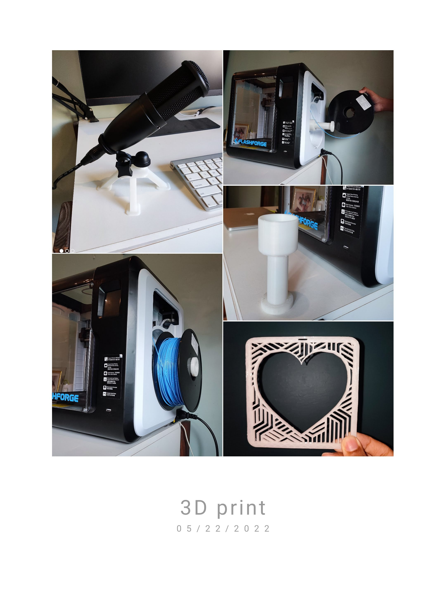

## Digital Logic & LED Matrix
#### ***Morse Code Radio Communication Device***
Our final project in Digital Logic was to “build something using an FPGA”. I was very interested in LED matrices because they seemed cool. I wanted to build an LED matrix and animate it. I started thinking how I would control the large number of LEDs, and not being able to figure out an efficient solution, did research on LED matrices. I understood how electronic signals are encoded for the HUB75 protocol. I learnt the mechanics of shift-registers and latches, and even the theory of how an LED matrix is made. My teacher recommended that I buy a prebuilt LED matrix and learn to control it using an FPGA so that I wouldn’t waste time soldering and building with a tedious number of LEDs.

I tried to control the matrix with an FPGA, and when that failed, used a logic analyzer to reverse engineer the signals being sent by the Raspberry Pi library. Once I figured out how to control it using an FPGA, I wrote Verilog code to draw various shapes and characters, and later, animate the matrix.

I had time left over, so I took over an interest I had earlier in the year and learnt to use the RYLR998 LoRa Transceiver with an Arduino. I implemented a custom communication standard between the Arduino and FPGA. I designed and bought custom PCBs that simplified the wiring in my circuit by using ribbon cables and their respective sockets between the matrix, Arduino, and FPGA. I used MX Blue Keyboard switches to give the buttons a satisfying feel. My final product was a radio Morse code communication device. The transmitter (technically they were both transceivers, but that would require two FPGAs and two matrices, which was expensive to implement) could send messages in Morse code using the buttons (Dot, Dash, Next Word, Send). The LoRa module would transmit it over radio and the receiver would type out the message in English on the LED matrix. The FPGA drives the display of characters on the LED matrix while the Arduino drives the radio communication and translation from Morse code to English.

As for making the device aesthetically pleasing, I laser cut an acrylic platform which I screwed onto the FPGA’s existing acrylic protection cover. I then screwed the PCB onto the acrylic platform and also used magnetic spikes that the LED matrix could magnetically snap onto.

Most of the work was my own with no outside help. I used AI to create the large hardcoded Verilog busses for the matrix alphabet. I experimented with AI to see how useful it would be on the Arduino code, and didn’t like how it took the fun away from coding, so stuck to doing it by myself.



*Initial progress with LED matrix. 1, 2, 3, and 4 show matrix controlled by FPGA. 5 and 6 show matrix controlled by Raspberry Pi (black stripes due to camera flicker).*




*PCB Board and demonstration of LED matrix’s magnetic spikes*




*Final Product. Code: [https://github.com/Zo-Bro-23/led-matrix]()*

#### Morse Only
<iframe class="responsive-video" src="https://www.youtube.com/embed/I-34KFBpLcI" title="Morse Code LED Matrix (non wireless)" frameborder="0" allow="accelerometer; autoplay; clipboard-write; encrypted-media; gyroscope; picture-in-picture; web-share" referrerpolicy="strict-origin-when-cross-origin" allowfullscreen></iframe>

#### Morse and LoRa
***Question mark indicates invalid character***
<iframe width="315" height="576" src="https://www.youtube.com/embed/oWIWyAT-WBA" title="Morse Code LED Matrix (wireless)" frameborder="0" allow="accelerometer; autoplay; clipboard-write; encrypted-media; gyroscope; picture-in-picture; web-share" referrerpolicy="strict-origin-when-cross-origin" allowfullscreen></iframe>

## Old Engineering Work
### 3D Printing Projects
- [Thingiverse](https://www.thingiverse.com/zobro23/designs)
- [GitHub](https://github.com/Zo-Bro-23/3D-Printing)

From the top:
- Stand I designed and printed for my microphone
- Extension I designed and printed to use bigger filament spools with my printer
- Aesthetic piece I designed and printed for home decor

### Robotics
- Participated in university-level robotics competitions as part of a robotics team
- Have made multiple projects including a smart burglar alarm, remote-controlled boat, and a go-kart made of wood and PVC

#### Obstacle-sensing car

<iframe width="487" height="274" src="https://www.youtube.com/embed/wvp22Te1N5U" title="Arduino Car with Obstacle Detection" frameborder="0" allow="accelerometer; autoplay; clipboard-write; encrypted-media; gyroscope; picture-in-picture" allowfullscreen></iframe>