I interned this summer in the Goldgof AI Lab ([https://www.hemepath.ai/]()) at Memorial Sloan Kettering Cancer Center, NYC. The lab works on many projects and papers simultaneously, but all the projects are focused on using machine learning and computer vision for cancer diagnosis or practitioner assistance, and results range from clinically deployed software to journal papers. When I started, I did not know much about machine learning, so my mentor encouraged me to spend a few days learning by myself. I was strongly encouraged to use AI tools like Cursor and ChatGPT. Coming from my school’s strict no-AI policy, I was uncomfortable, but soon learnt to use Cursor to teach myself by asking it to walk me through a tutorial or asking it to explain unknown code. I watched YouTube videos to understand the basics of machine learning, and played around with creating some models myself.

I asked to work on Whole Slide Imaging, which interested me the most out of the numerous problems the lab was working on. I was presented with a problem on **WSI segmentation and tiling**. One of the products they are currently working on uses **Multiple Instance Learning** to detect leukemias and lymphomas from slide samples of patients with **lymphoproliferative disorders**. The challenge I was tasked with solving involved the first step in this pipeline process. The tissues needed to be segmented and patched, meaning that I needed to split a whole side image into tiny tiles or patches of the tissues in that slide. This is because WSIs are often hundreds of thousands of pixels wide, and the machine learning models can only take images that are 256, 512, 1024, etc pixels wide. Tiling sections of the slide that are whitespace would be hugely inefficient, and tiling sections of the image with ink or writing could mess up the training process of the models downstream (only positive slides would have + symbols, for example). So I had to detect tissue and tile only those regions of the image. The current solution used was a Deep Learning library developed by the **Mahmood Lab at Harvard** ([https://github.com/mahmoodlab/TRIDENT]()). It was very time consuming and not very accurate for our use-cases either. I was told to create an independent tool that could segment tissues from WSI and tile the WSI in a time efficient manner. I was encouraged to use classical computer vision.

Through a lot of brainstorming, discussions with my mentor, and experimenting with Cursor, I developed a tool that worked surprisingly well, and better than my competitor in accuracy and performance efficiency. There were challenges I had to work around such as ink and dirt on the slides, but my tool managed to perform well against these adversaries.

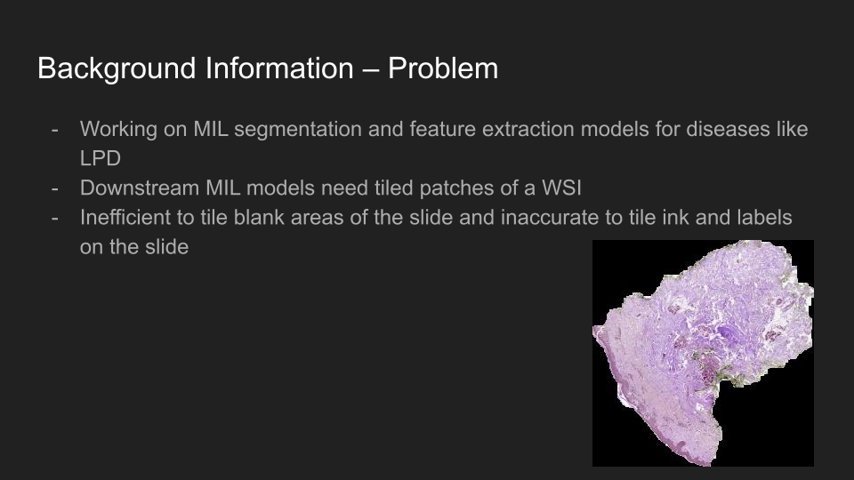
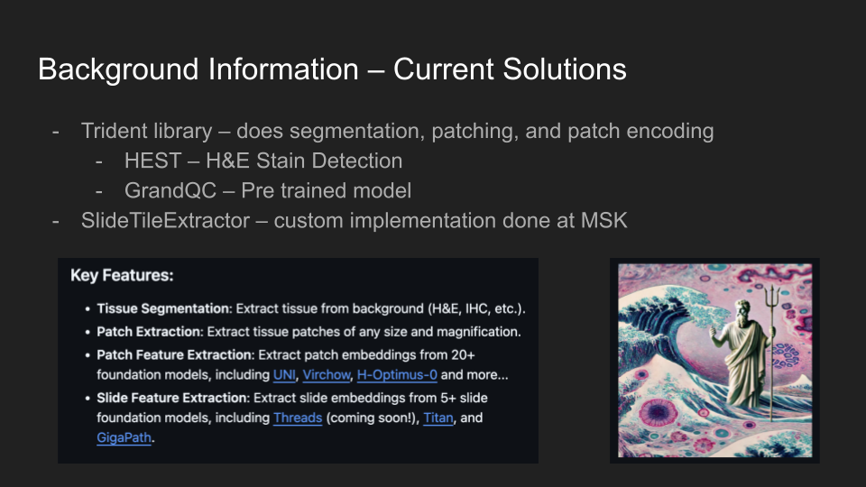
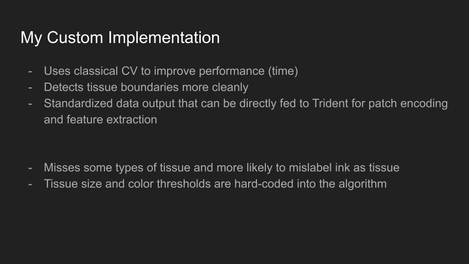
*Slides from my presentation to the lab*

Trident is the Deep Learning implementation by the Mahmood lab, and **SlideTileExtractor is an in-house implementation** developed by someone at MSK. The latter, however, has many hardcoded variables such as tissue blob size and ink color, and does not work well for different types of slides.

Here is how my tool works. First, I use OTSU thresholding and morphological operations to reduce noise in the image.

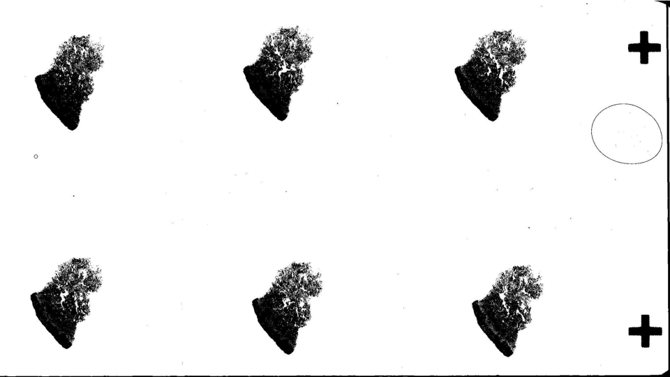
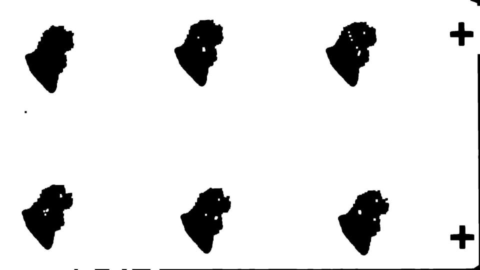

Then, I iterate through each blob in the image. I check the blob against some hard-coded conditions for size and color (hue, not saturation or value). I then draw contours and export the data in a format (geojson) such that the Trident library can then perform tiling on its own using the segmentation computed by my tool.

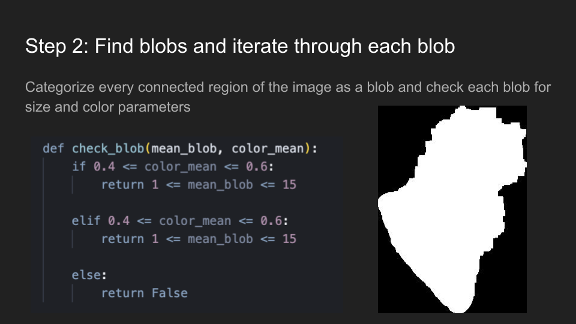
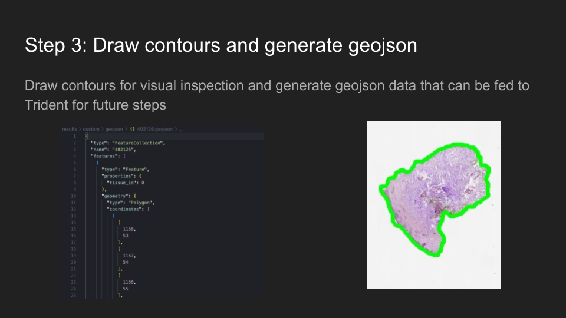
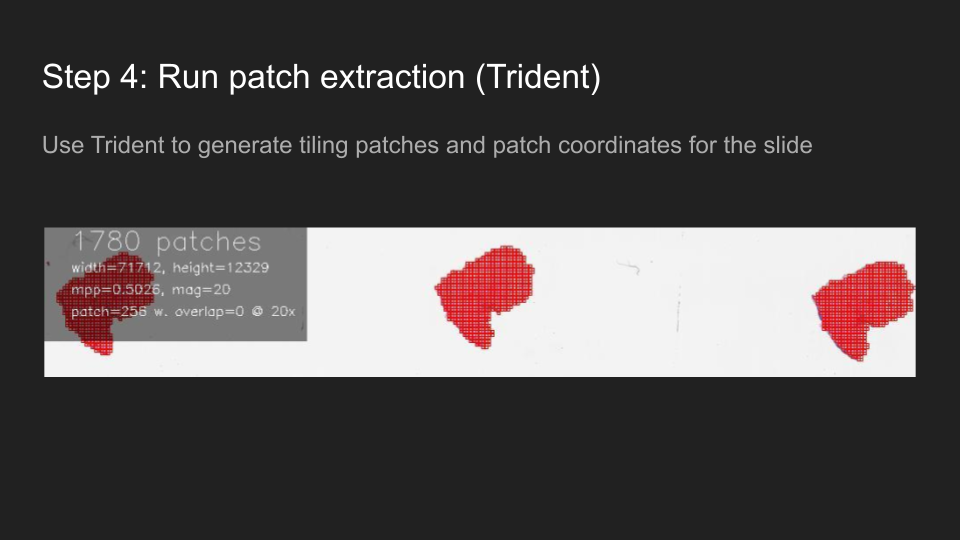

In order to present my work at lab meeting, I had to benchmark and compare my tool with the other two existing solutions.

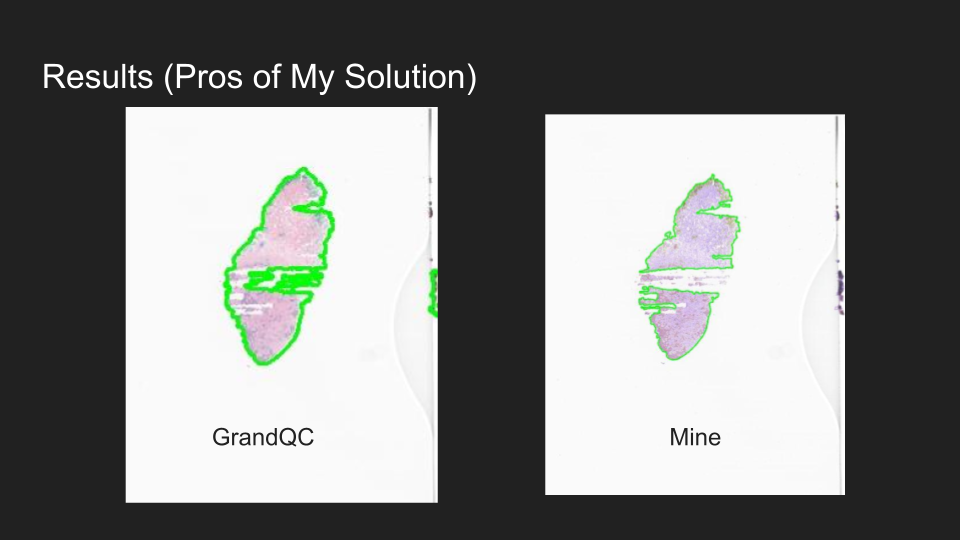
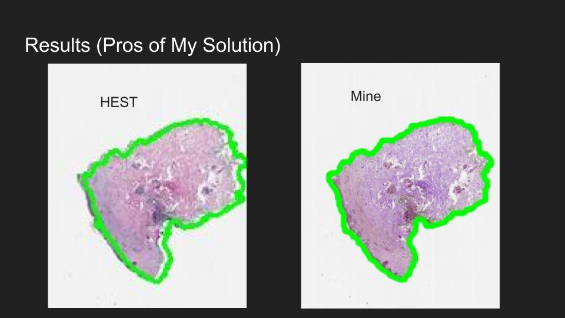
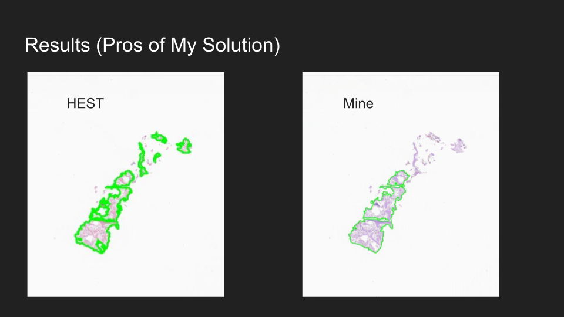
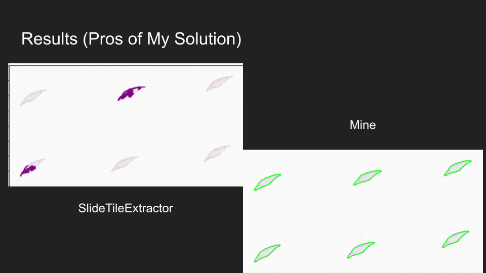
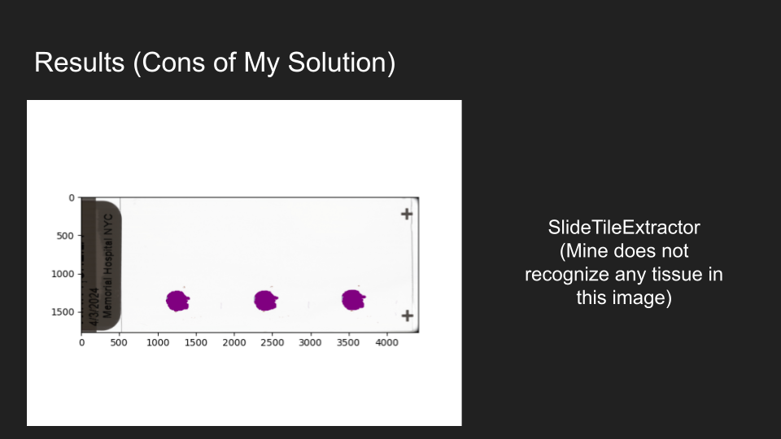
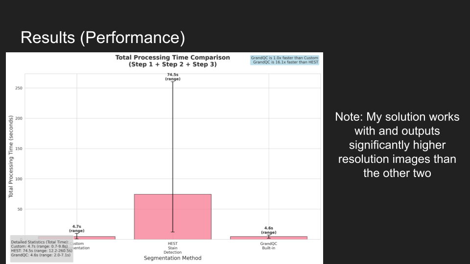
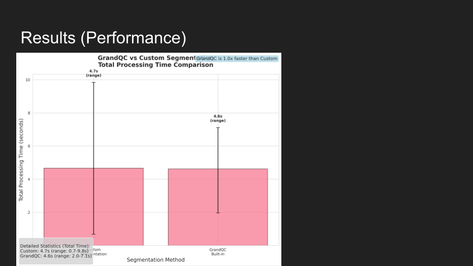

The lab was very impressed with my results, and promised adaptation of my work for use in consumer-facing MIL pipelines. I could not continue working on my project because school started, but I hope to get back and resume work with the Goldgof Lab soon (maybe the upcoming summer).

I lost access to my version-controlled code due to organization credential issues, but here is a copy of my code: [https://github.com/Zo-Bro-23/tissue-segmentation]()