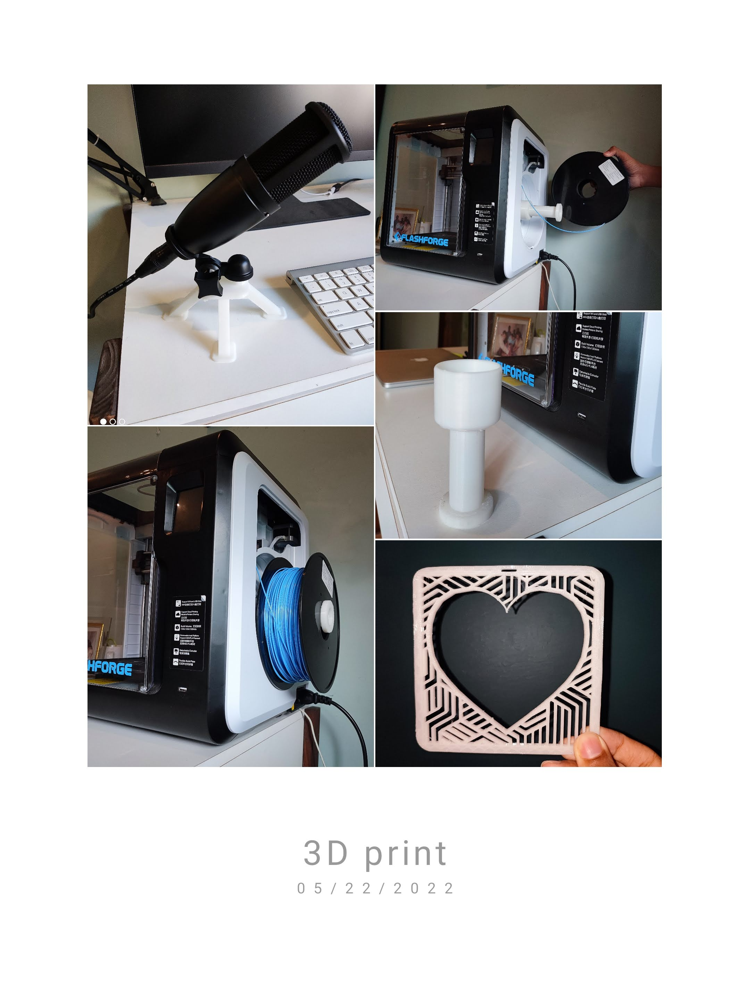

## 3D Printing Projects
- [Thingiverse](https://www.thingiverse.com/zobro23/designs)
- [GitHub](https://github.com/Zo-Bro-23/3D-Printing)

From the top:
- Stand I designed and printed for my microphone
- Extension I designed and printed to use bigger filament spools with my printer
- Aesthetic piece I designed and printed for home decor

## Robotics and Engineering
### Experiences
- Participated in university-level robotics competitions as part of a robotics team
- Have made multiple projects including a smart burglar alarm, remote-controlled boat, and a go-kart made of wood and PVC

### Obstacle-sensing car

<iframe width="487" height="274" src="https://www.youtube.com/embed/wvp22Te1N5U" title="Arduino Car with Obstacle Detection" frameborder="0" allow="accelerometer; autoplay; clipboard-write; encrypted-media; gyroscope; picture-in-picture" allowfullscreen></iframe>
