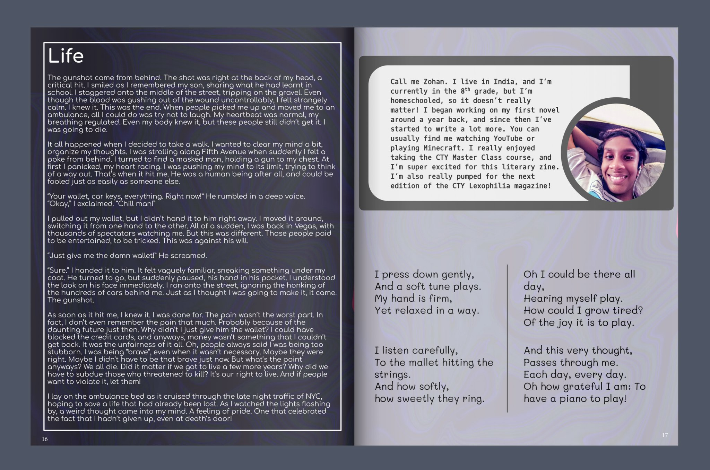

## Party Crashers
*(My first novel!)*

<iframe src="assets/PartyCrashers.pdf" frameborder="0" width="100%" height="650px"></iframe>

## CTY Literary Zine

### Experiences
- Wrote a 40000+ word children's novel that is currently in the publishing stage (preview of first chapter above)
- Participated in the Johns Hopkins CTY Master Class (Writing, Editing, and Publishing) workshops, and was part of the poetry committee for the CTY Literary Journal (Lexophilia)
- Love experimenting with new genres and ideas :)